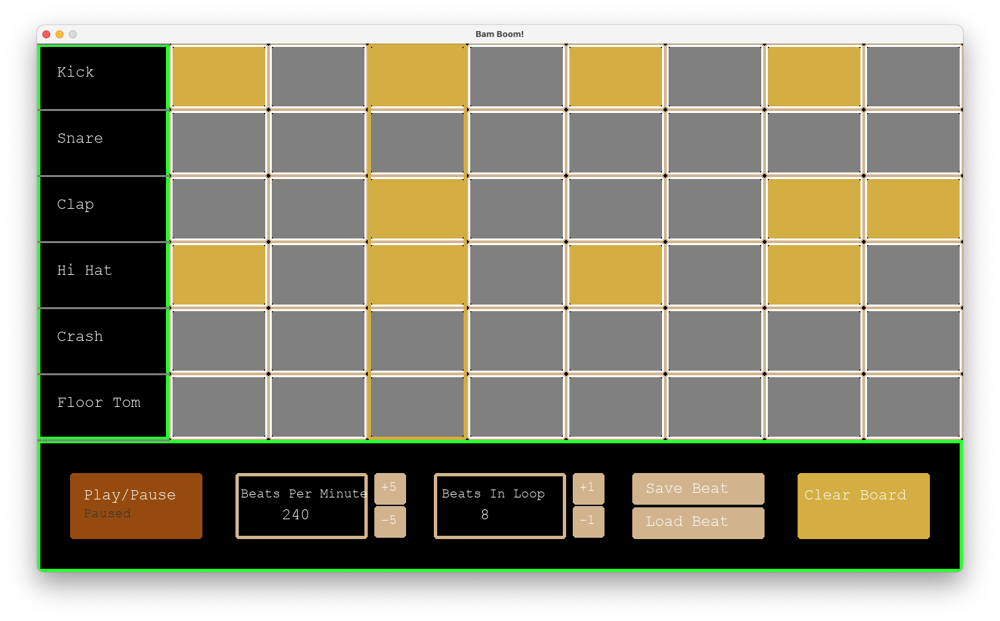

# Bam Boom Drum Sequencer

Bam Boom Drum Sequencer is a Python App for sequencing your own drum beat locally on a computer.

The end goal is to create a Drum Sequencer that will play and loop through a sequence as programmed by the user.

## Installation

Use the package manager [pip](https://pip.pypa.io/en/stable/) to install the PyGame library.

```bash
pip install pygame
```

File & Folder Path:

```
.
└── bam-boom
    ├── Courier-New.ttf
    ├── Roboto-Bold.ttf
    ├── __pycache__
    │   └── main.cpython-313.pyc
    ├── main.py
    ├── saved_beats.txt
    └── sounds
        ├── CR78
        ├── LM1
        │   ├── BD LM1 Color A 15.wav
        │   ├── BD No Filt LM1 Color A 08.wav
        │   ├── CH Accent V1 LM1 Color Decay A 25.wav
        │   ├── CH V1 LM1 Color Decay A 25.wav
        │   ├── Cabasa LM1 Color B 07.wav
        │   ├── Clap LM1 22.wav
        │   ├── Clap LM1 Color B 02.wav
        │   ├── Cowbell LM1 Color 15.wav
        │   ├── OH V1 LM1 Color 25.wav
        │   ├── Rimshot LM1 Color A 13.wav
        │   ├── SD LM1 Color A 22.wav
        │   ├── SD LM1 Color C 01.wav
        │   ├── Tom A LM1 Color A 23.wav
        │   ├── Tom A No Filt LM1 Color B 12.wav
        │   ├── Tom B LM1 Color A 17.wav
        │   ├── Tom B No Filt LM1 Color B 20.wav
        ├── LinndrumKit
```

## Usage

main.py

```python
import pygame
from pygame import mixer
pygame.init()

kick = mixer.Sound('sounds/LM1/BD LM1 Color A 15.wav')
snare = mixer.Sound('sounds/LM1/SD LM1 Color C 01.wav')
clap = mixer.Sound('sounds/LM1/Clap LM1 Color B 02.wav')
hi_hat = mixer.Sound('sounds/LM1/CH Accent V1 LM1 Color Decay A 25.wav')
crash = mixer.Sound('sounds/LM1/OH V1 LM1 Color 25.wav')
tom = mixer.Sound('sounds/LM1/Tom A LM1 Color A 23.wav')

screen = pygame.display.set_mode([WIDTH, HEIGHT])
pygame.display.set_caption('Bam Boom!')
label_font = pygame.font.Font('Courier-New.ttf', 24)
medium_font = pygame.font.Font('Courier-New.ttf', 20)
beat_changed = True
timer = pygame.time.Clock()
fps = 60
beats = 8
bpm = 240
instruments = 6
playing = True
clicked = [[-1 for _ in range(beats)] for _ in range(instruments)]
active_list = [1 for _ in range(instruments)]
pygame.mixer.set_num_channels(instruments * 3)
save_menu = False
load_menu = False
saved_beats = []
file = open('saved_beats.txt', 'r')
for line in file:
    saved_beats.append(line)
beat_name = ''
typing = False
index = 100

# ...
```



## Contributing

Pull requests are welcome. For major changes, please open an issue first
to discuss what you would like to change.

Please make sure to update tests as appropriate.

A major thanks to LeMaster Tech [@plemaster01](https://github.com/plemaster01) for initiating and creating the original project!

## License

Creative Commons

[The Unlicense] (https://choosealicense.com/licenses/unlicense/)
